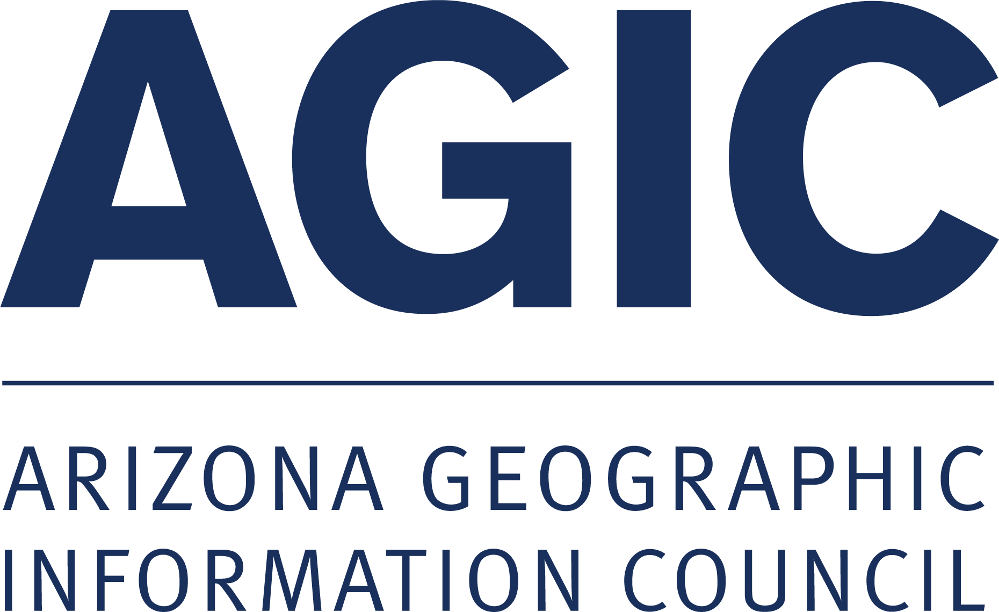
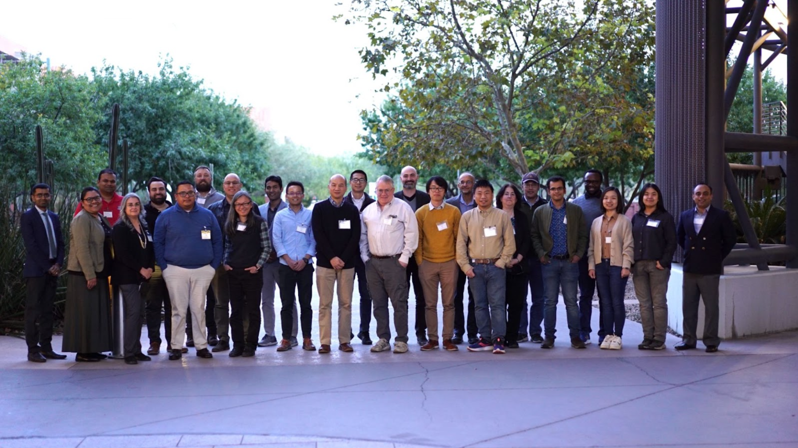
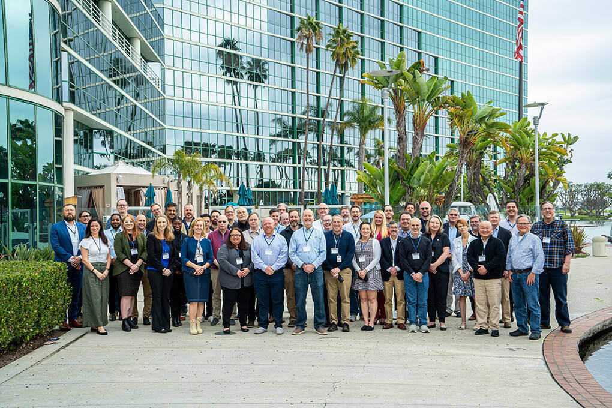
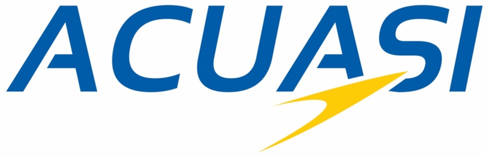
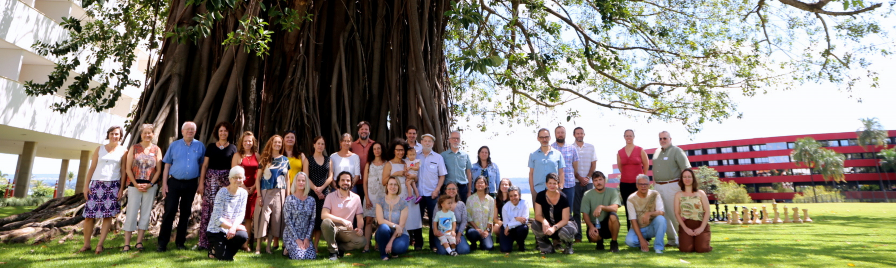
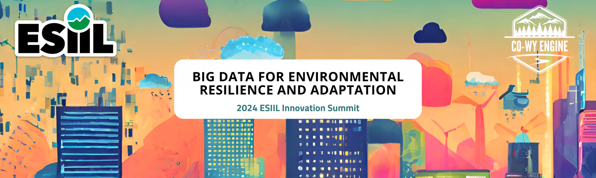
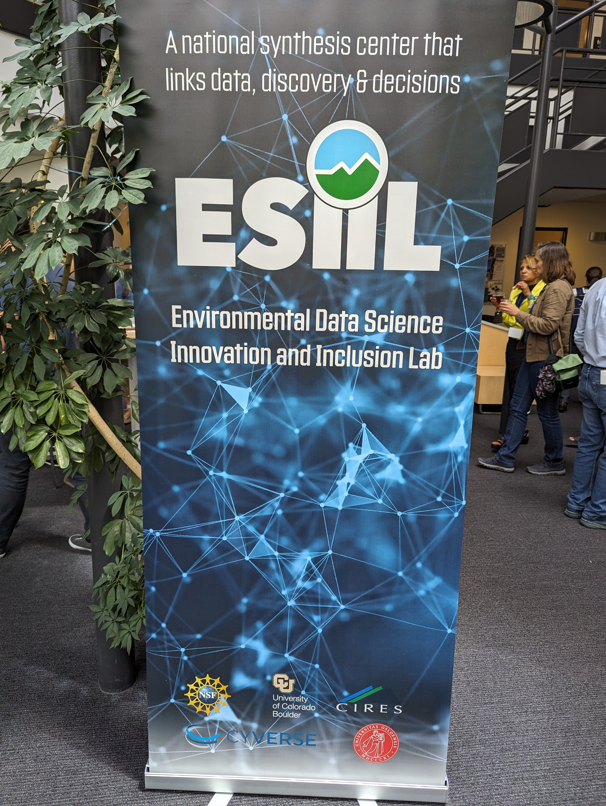
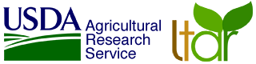
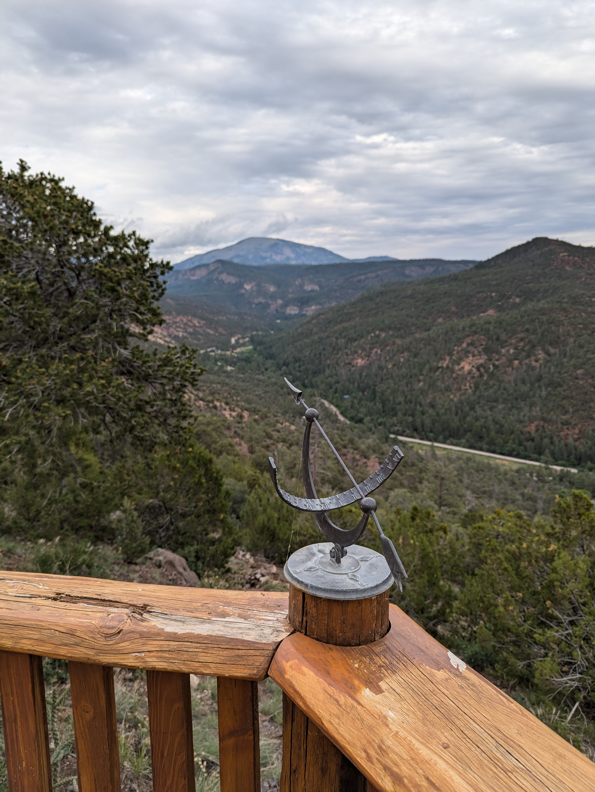
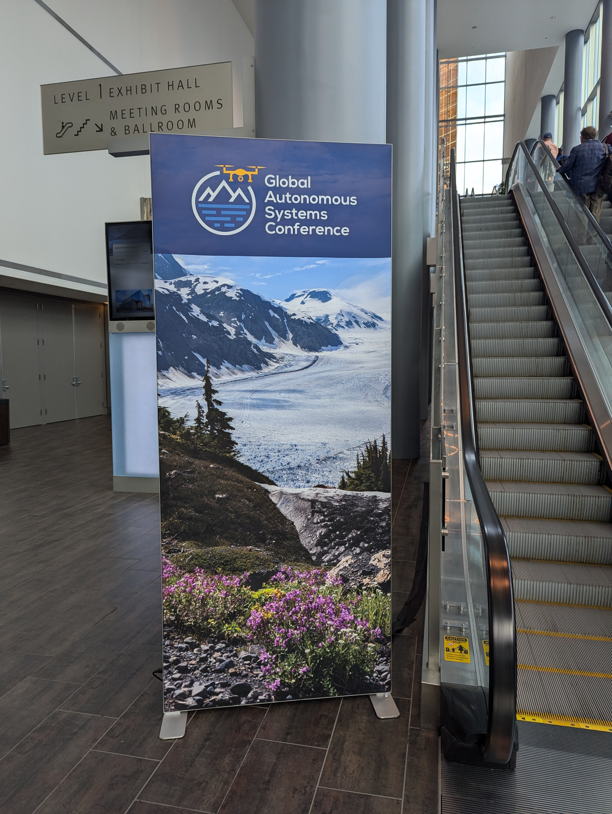

# A year (plus a couple of months) in review

In the last twelve months I have travelled more miles than ever before in my life. In part because of post-COVID travel reauthorization and the desire to meet in-person again, and the growth of my professional network during COVID.  The near universal need for shared cyberinfrastructure and growth of team science over the last four years has led to numerous new funded research projects for me through CyVerse and ICDI.

Below, I've summarized these trips and other meetings with national programs as they relate to the direction my team will be working over the next few years around AI, digital twins, and open science.

# Late 2023

As I start this travelogue, let me indulge by covering the last few months of 2023, as they relate to more current events of this last year.

## 08/31 - 09/03 AGIC, Prescott, Arizona

{width=200}

The [Arizona Geospatial Information Council (AGIC)](https://agic.az.gov/agic/){target=_blank} supports GIS data across the civil and governmental sectors of Arizona. Jeff Gillan and I presented on [Cloud Native Geospatial](https://www.gillanscience.com/cloud-native-geospatial/){target=_blank} data sets and cyberinfrastructure. 

{width=300}

One of our goals at AGIC is to spread awareness of University of Arizona resources, like CyVerse, and our forthcoming Arizona Data Commons project in collaboration with the [OpenStorageNetwork](https://openstoragenetwork.org){target=_blank}. I already have resources to support remote sensing data for the state of Arizona in my CyVerse owned resource storage services. 

## 09/04 - 09/08 Yale University, New Haven, Connecticut 

In September of 2023, Nirav and I visited Yale to meet with researchers working to expand a national infrastructure for monitoring natural methane emissions. Natural methane sources are emissions that originate from marshes and bogs as well as from agriculture, i.e., water intensive farming (e.g., rice) and livestock grazing. In contrast, point-sources of methane emissions, such as leaking gas wells, are specific, identifiable locations—often resulting from human activities where methane is released into the atmosphere. 

{width=800}

The proposed observatoy would have been a compliment to the existing NEON and Ameriflux eddy-covariance networks. Unfortunately, this proposal was not funded and is again delayed. 

## 10/23 - 10/25 NASA-ARID, Tucson Arizona

{width=300}

In October, a local meeting held at University of Arizona was convened to support the next NASA Earth Sciences mission, a successor to [Arctic-Boreal Vulnerability Experiment (ABoVE)](https://above.nasa.gov/){target=_blank}. This new proposed mission is called "[Adaptation and Response in Drylands (ARID](https://aridscoping.arizona.edu/){target=_blank}", and is led by USGS and University of Arizona researchers.

## 11/29 - 12/01 SHEKATE, Salt Lake City, Utah

{width=300}

In early December, I flew to a foggy SLC for a meeting of the WestNet consortium to hear about opportunities for regional innovation in cyberinfrastructure, [Southwest Higher Education Knowledge and Technology Exchange (SHEKATE)](https://sites.google.com/view/nsf-asu-regional-planning/home){target=_blank}. 

{width=300}

In my daily work, cyberinfrastructure is more 0 and 1 than fiber optic cable and iron server rack assembly. The [WestNet](https://www.westnet.net/){target=_blank} group included CTOs, DOTs, IT, DevOps, and Cloud managers from Internet2 (I2), Sun Corridor & The Quilt. It was interesting to listen about thy physical infrastructure side of cyberinfrastructure for several days.

## 12/4 - 12/6 NSF CISE, Tucson, AZ

{width=300}

The NSF CISE [Research Expansion Aspiring Investigators Conference: Southwest meeting](https://www.westbigdatahub.org/post/cise-southwest-research-expansion-aspiring-investigators-conference-held-in-tucson){target=_blank} was held at BIO5 Institute, on the University of Arizona and hosted by the [PI Vignesh Subbian](https://www.nsf.gov/awardsearch/showAward?AWD_ID=2336054){target=_blank}.

{width=800}

# 2024 

## 01/08 - 01/10 OpenDendro, Tucson Arizona

{width=200}

The end of our NSF collaborative research award to update legacy software for dendrochronological research included a summit on the state of the scientific software used by the community. The Principal Investigator's of [OpenDendro](https://opendendro.org/){target=_blank}, Kevin Anchukaitis and Andy Bunn brought a group of technically saavy dendrochronologists to the Laboratory of Tree Ring Research, where dendrochronology was born, to learn about the work we've achieved. 

{width=320} {width=320}

I am so proud of Ifeoluwa Ale's work to write the [first Python package](https://pypi.org/project/dplpy/){target=_blank} for time-series analysis in tree rings based on the older `dplR` packages by Andy Bunn and FORTRAN77 `dpl` programs.

## 01/12 - 01/15 Plant and Animal Genome, San Diego, California

{width=800}

CyVerse has been featured at the [PAG meeting](https://pag.confex.com/pag/31/meetingapp.cgi/Home/0) in San Diego for the last 16 years. This year however, the project began to show its change of direction. For the first time, we did not host a table in the vendor space. Instead we only held an early morning session on AI. 

{width=800}

Nirav and I presented on the new AI tools built by the CyVerse team to leverage open source large language models (LLMs) in private and secure environments, on premises. My recent GPU hardware acquisitions, funded by ABOR TRIF are supporting this effort. 

{width=320} {width=320}

## 01/16 - 01/18 CI-Compass, Long Beach, California

{width=800}

I have been a member of the CI-Compass Cloud Working Group for the last several years. This year, we presented our report on [Cloud use for Major Facilities](https://zenodo.org/records/10481410){target=_blank} at the Cyberinfrastructure for Major Facilities [CI4MF](https://ci-compass.org/news-and-events/news/collaboration-in-action-2024-making-connections-improving-cyberinfrastructure/) meeting in Long Beach.

Specific to the findings of our report and presentations by other speakers, the storage of scientific data on-premise (i.e., university hosted data centers), and the use of Major Facilities for research computing are massive cost-savings over commercial cloud solutions, saving tax-payers potentially billions of dollars.

## 01/23 M580, Tucson, Arizona

{width=300}

On my way to the airport, I stopped off at the [National Advanced Fire & Resource Institute (NAFRI)](https://www.nafri.gov/){target=_blank} to present on technology and data applications at the [M580 Fire in Ecosystem Management](https://www.nwcg.gov/committee/m580-fire-in-ecosystem-management-course-steering-committee{target=_blank} course. 

{width=800}

I have presented every year for the last four years at the meeting. It is nostalgic and bittersweet to watch and hear how fire management has changed over the last twenty two years since I started a first career as a wildland firefighter. 

## 01/23 - 01/28 ACUASI, Fairbanks, Alaska

{width=300}

{width=320}

Jeff Gillan and I traveled to Fairbanks Alaska to meet with our colleague Professor Peter Webley at the University of Alaska Fairbanks, where we met with the staff of the [Alaska Center for Uncrewed Aerial Systems Integration (ACUASI)](https://acuasi.alaska.edu/){target=_blank}. While the Alaskan weather greeted us with -43F temperatures, the visit was warm and productive. 

{width=320} {width=320}

This collaboration has resulted in the signing of a MOU between University of Arizona and University of Alaska Fairbanks. Both Universities are the land grant institutions of their respective state. We will exchange ideas, students and staff, around the shared interests of cyberinfrastructure, national security, UAS and sUAS, and AI. 

## 02/05 - 02/09 Scientific proposal review panel, Virtual 

In February, I served as a panelist for a scientific funding agency. All of the proposals focused on the use of AI, including large language models and generative AI -- which are things that were mostly unknown (at least to me) 24 months ago.

## 02/25 - 03/02 Sinbiose, Brasilia, Brasil

{width=800}

In February, I traveled with my colleagues from CU Boulder and officals from the NSF to Brasilia Brasil for a collaborative summit between Brasilian and United States ecological researchers called [Sinbiose](https://esiil.org/esiil-sinbiose-workshop){target=_blank}.

## 03/26 - 03/29 Biosphere 2, Catalina, Arizona

{width=800}

In March, Jeff Gillan and I hosted colleagues from Purdue, NEON (Battelle Inc), OpenTopography, and Alaska at Biosphere 2 (B2) for two nights to discuss the directions of uncrewed aerial systems research (UAS) and small UAS (sUAS). We are pursuing NSF funding for a larger data management and artificial intelligence platform for UAS derived data sets that is currently under review.

{width=320}{width=320}

## 04/03 - 04/05 Chishiki-AI, Austin, Texas 

{width=300}

In April, Nirav and I went to Texas Advanced Computing Center (TACC) to participate in a workshop on digitalt twins and AI for civil engineering, [Chishiki-AI](https://www.chishiki-ai.org/){target=_blank}. 

Nirav and I also got [my first] personal tour of the TACC facility by director Dan Stanzione. It was incredible seeing the scale of what one of NSF's major facilities is for AI and computational research. TACC is the home of NSF's future Leadership Class Computing Facility, which is now breaking ground. 

## 04/09 - 04/12 Ecological Forecasting Initiative, Portsmouth, New Hampshire

{width=300}

In April, I attended the [Ecological Forecasting Initiative's Cyberinfrastructure Meeting](https://ecoforecast.org/cyberinfrastructure/){target=_blank}. EFI discussions centered around the advancement of ecological research into digital twins, and hosting of large earth system scale datasets. 

{width=800}

## 05/13 05/17 ESIIL Summit, Boulder, Colorado

{width=800}

{width=800}

ESIIL hosted its [second innovation summit](https://esiil.org/innovation-summit){target=_blank}, this year the theme was on environmental resilience and adaptation, and best practices of open science.

{width=320} {width=320}

## 05/21 - 05/23 LTAR All Scientists, Tucson, Arizona

{width=300}

The [USDA-ARS LTAR meeting](https://ltar.ars.usda.gov/ltar-home-extended/){target=_blank} was held in Tucson at University of Arizona this year. I provided a short talk about the use of Cyberinfrastructure and Open Science to the group. This marks a decade of collaboration with Phil Heilman, director of the Southwest Watershed Research Center (SWWRC) and our local ARS research groups. 

## 06/20 - 06/21 SWEETER, Tucson, Arizona

{width=300}

In June, I attended the wrap-up of Arizona's collaborative effort on South West Expertise in Expanding Training, Education and Research (SWEETER) for AI with attendees from Western Arizona Community College and Diné College. SWEETER is a CC* funded program by the NSF.

## Summer Break

{width=800}

In late June, with my wife and children we vacationed in the Jemez Mountains at my parent's home. My sister and her family live in nearby Los Alamos, about 45 minutes drive around the Valles Caldera where my PhD research took place. 

{width=320} {width=320}

In July, we travelled to Europe to visit with my wife's family friends in the Black Forest of Germany. While there we toured Switzerland and Italy, with a short stop in Copenhagen, Denmark, on the return trip. 

{width=800}

{width=320} {width=320}

## 08/12 - 08/16 GASC, Anchorage Alaska

{width=300}

In August, I returned to Alaska to join the ACUASI group for their annual [Global Autonomous Systems Conference (GASC)](https://autonomousalaska.com/){target=_blank}. Various piscussions centered around AI, UAS air mobility, and the use of foreign built small UAS by government.

{width=320} {width=320}

The meeting was attended by numerous dignataries, including the Governor of Alaska, lone US Congresswoman and a US Senator. All relayed to the conference their whole hearted support of Alaska in uncrewed aerial systems research and innovation. The majority of Alaska's villages and tribal communities live in remote areas that are only connected by aircraft for much of the year. 

{width=800}

## 09/11 - 09/12 - MaGIC, Madison Wisconsin

{width=400}

{width=800}

In September, I travelled to the University of Madison to meet with a group of roboticists using AI and digital twins to build and to pilot autonomous vehicles many of which are operated in the vacuum of space and on other planetary bodies like the moon, Mars, and asteroids. The [Machine Ground Interaction Consortium (MaGIC)](https://sbel.wisc.edu/magic/magic-2024/){target=_blank}, led by Professor Dan Negrut and his [S]imulation Based Engineering Lab (SBEL)](https://sbel.wisc.edu/){target=_blank} was a late highlight of my year travelling. 

{width=800}

I am now helping MaGIC and SBEL team to train and design generative AI tools for working with robots, leveraging large GPU resources from the NSF ACCESS-CI at Texas A&M (ACES). 

## 10/06 - 10/09 NCEMS, Chicago Illinois

{width=300}

{width=800}

In early October, I flew to Chicago and stayed at the O'Hare Hilton Hotel (never leaving the airport property) to attend the kick-off summit meeting of the NSF [National Synthesis Center for Emergence in the Molecular and Cellular Sciences (NCEMS)](https://ncems.psu.edu/){target=_blank}.

{width=800}

CyVerse will be providing the cyberinfrastructure resources to the new center, in the same design as ESIIL is using, for the next 5 and hopefully 10 years. 

